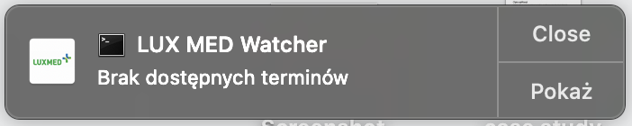

# LUX MED Watcher

Simple puppeteer bot that checks if there are any available dates for a given referral.

## Usage

### Required environment variables

```sh
LOGIN=user@example.com
PASSWORD=password
REFERRAL_ID=999999999
```

### Optional environment variables

```
# Additional identification to show in notification title
# Can be helpful when there are multiple watchers set
REFERRAL_TYPE=internista

# Turn on headless mode
HEADLESS=true

# Send notifications to other devices with Pushover
# (only when there are available dates)
PUSHOVER_USER=pushover-user
PUSHOVER_TOKEN=pushover-application-token
PUSHOVER_DEVICE=pushover-device-name
```

### How to get referral id


### Run

Install dependencies

```
npm i
```

Use headless mode to check if there are any available dates.
You will get notification about the result – at this point you can decide if you want to see results or not.




```sh
HEADLESS=true node index.js
```

If you want to see results in chromium browser use standard mode.

```sh
node index.js
```

### Watcher

If you want to check for available dates periodically you can use Crontab for this.
For example to run LUX MED Watcher every 15 minutes follow those steps:


Open cron jobs list with `crontab -e` and add following job (each job should be placed in ots own line):
```
*/15 * * * * cd /path/to/luxmed-watcher && HEADLESS=true REFERRAL_ID=999999999 /path/to/bin/node index.js
```
Make sure to replace `/path/to/luxmed-watcher` with a valid path to this repository and `/path/to/bin/node` with absolute path to `node` binary (you can check it with `which node`). To see your active cron jobs, use the `crontab -l` command.
